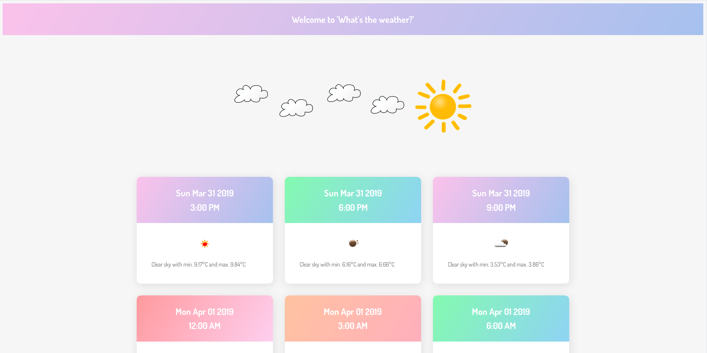

# What's the weather?

## What is it about?

A simple javascript that gathers weather information and displays them in a
detailed 3 hours/ 5 days-forecast for a city of your choice.

Big shout-out to Tania Rascias [article](https://www.taniarascia.com/how-to-connect-to-an-api-with-javascript/) about dealing with APIs in
javascript. I learned a lot!

## How does it work?

Data is provided by [Openweathermap](https://openweathermap.org/) and requested
via API request. In order to run this script, you need to register an API-key which can
be done [here](https://openweathermap.org/api).

## How to use it?

After you obtained the API-key, you need to place it in `config.js`.
Finally you just need to open `index.html` with your favourite browser.
Enjoy your weather forecast!

## Credits

[Weather logo](https://pixabay.com/vectors/cloudy-sun-clouds-sunny-weather-296479/) 
is from Pixabay and royalty-free.

## Licensing

The code in this project is licensed under GNU GPLv3 license.